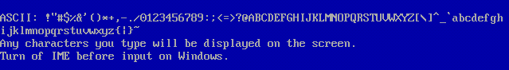
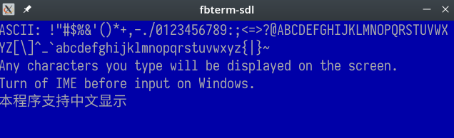

# fbterm

A terminal emulator for any framebuffer.

Also contains an abstraction of the framebuffer, which can draw images by pixel.

## purpose

Build for no_std environment,such as operating system(without vga text mode) and embedded display.

## Font

Builtin Font from seabios vgabios, same as most VGA-compatible graphics cards.

Support Truetype font thanks to `fontdue` crate, require `alloc`.

## Todo

- Documents
- Backspace
- Double Buffer
- String Buffer
- PSF font
- Cursor
- ANSI
