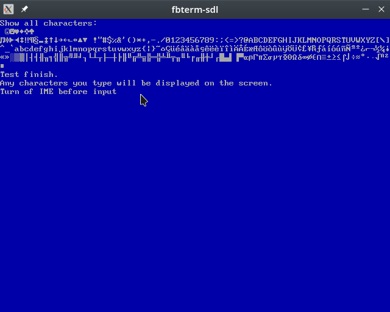
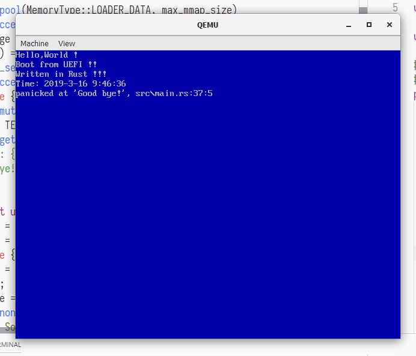

# fbterm

A terminal emulator for any framebuffer.

Also contains an abstraction of the framebuffer, which can draw images by pixel.

## purpose

Build for no_std environment,such as operating system(without vga text mode) and embedded display.

## example

SDL:

Input characters and show them in SDL window.

```txt
Fbterm test on SDL2

USAGE:
    fbterm_sdl [OPTIONS]

FLAGS:
        --help       Prints help information
    -V, --version    Prints version information

OPTIONS:
    -f, --font <font>        height of font [possible values: 8, 14, 16]
    -h, --height <height>    height of screen
    -w, --width <width>      width of screen
```



[My OS](https://github.com/12101111/os)

After exiting UEFI boot service, program can't use Simple Text Output Protocal, but can use existing UEFI framebuffer.My OS use this crate to print texts.



## Font and Code

Font from seabios vgabios, same as most VGA-compatible graphics cards

Code page: 437 ,also known as CP437, OEM-US, OEM 437, PC-8, or DOS Latin US

## Todo

    Cursor
    board support
    Buffer line
    Custom font
    Unicode map